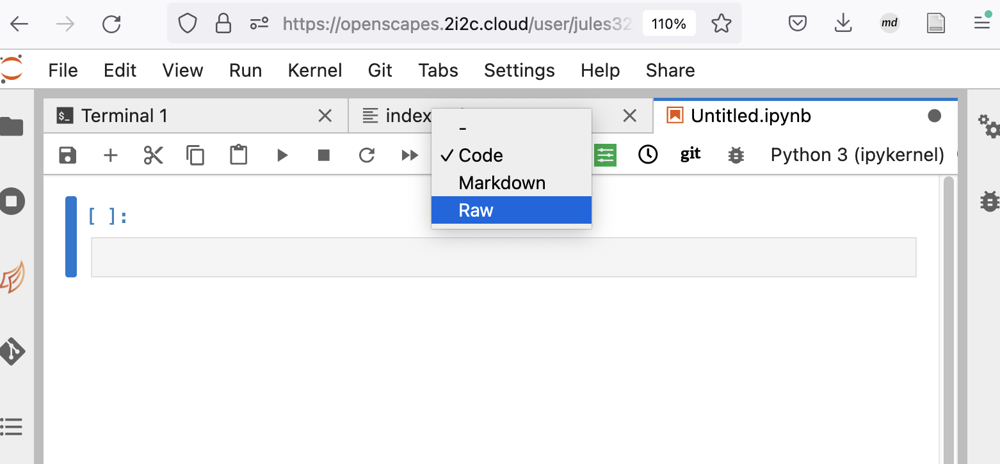
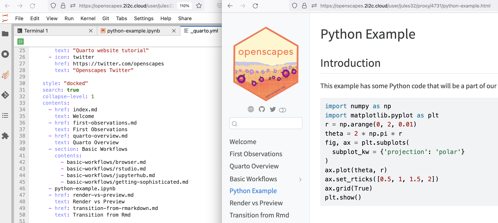
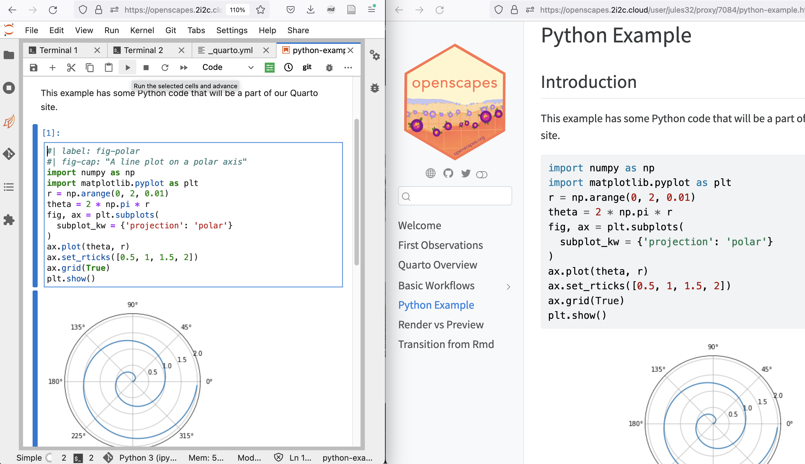

You can interact with Quarto through JupyterLab or JupyterHub. Your Jupyter setup will involve `.ipynb` notebooks and the command line. [Quarto's JupyterLab tutorials](https://quarto.org/docs/get-started/hello/jupyter.html) has great instructions on getting started with JupyterLab, including computations and authoring.

Here we will demonstrate how to work with this Quarto tutorial site in JupyterHub and add a Jupyter Notebook (`.ipynb` file). This example uses the NASA-Openscapes JupyterHub that already has all python environments as well as Quarto installed.

## Setup

### JupyterHub

Our JupyterHub is already setup with python environments as well as Quarto (through [nasa-openscapes/corn](https://github.com/nasa-openscapes/corn)), so there is no further installation required.

### Clone your repo

You'll start by cloning your repository into JupyterHub. Do this by opening a terminal (File \> New \> Terminal). In the Terminal, `git clone` your repository and `cd` into it:

``` bash
git clone https://github.com/openscapes/quarto-website-tutorial
cd quarto-website-tutorial
```

### Install Quarto

Not needed - Quarto is already installed on the NASA-Openscapes JupyterHub! But to install elsewhere you would do so from <https://quarto.org/docs/get-started/>.

Quarto is a Command Line Interface (CLI), like git. Once download is complete, follow the installation prompts on your computer like you do for other software. You won't see an application to click on when it is installed. 

*Note for Mac users: If you do not have administrative privileges, please select "Install for me only" during the Destination Selection installation step (you will first click on "Change Install Location" at the Installation Type step).*

You can check to confirm that Quarto is installed properly from the command line: 

``` bash
quarto check install
```

::: {.callout-note collapse="true"}
## Additional checks

You can also run:

-   `quarto check knitr` to locate R, verify we have the rmarkdown package, and do a basic render
-   `quarto check jupyter` to locate Python, verify we have Jupyter, and do a basic render
-   `quarto check` to run all of these checks together
:::

::: {.callout-tip collapse="true"}
## Historical aside: Install Quarto in a docker container

In Summer 2021 some NASA Mentors trying to install quarto locally was not an option, but they were able to install it inside a container using the following `Dockerfile`:

``` bash
#| fold: true
#| summary: "Show the Dockerfile"

##############################
# This Dockerfile installs quarto and then runs quarto serve against the
# internal /home/quarto/to_serve.
#
# BUILD
# -----
# To build this container, run
#
#     docker build -t quarto_serve .
#
# Add the --no-cache option to force docker to build fresh and get the most
# recent version of quarto.
#
#
# RUN
# ---
# 1. Find the directory you want quarto to serve. Let's call this /PATH/TO/earthdata-cloud-cookbook.
# 2. Run docker:
#
#     docker run --rm -it -p 4848:4848 -v /PATH/TO/earthdata-cloud-cookbook:/home/quarto/to_serve quarto_serve
#
# 3. Open your browser and go to http://127.0.0.1:4848/
#
##############################

FROM ubuntu:hirsute

######
# Install some command line tools we'll need
######
RUN apt-get update
RUN apt-get -y install wget
RUN apt-get -y install gdebi-core
RUN apt-get -y install git


######
# Install quarto (https://quarto.org/)
######

# This is a quick and dirty way of getting the newest version number from
# https://github.com/quarto-dev/quarto-cli/releases/latest. What's happening is
# we're pulling the version number out of the redirect URL. This will end up
# with QVER set to something like 0.2.11.
RUN QVER=`wget --max-redirect 0 https://github.com/quarto-dev/quarto-cli/releases/latest 2>&1 | grep "Location" | sed 's/L.*tag\/v//' | sed 's/ .*//'` \
    && wget -O quarto.deb "https://github.com/quarto-dev/quarto-cli/releases/download/v$QVER/quarto-$QVER-amd64.deb"
RUN gdebi -n quarto.deb

# Run this to make sure quarto installed correctly
RUN quarto check install


######
# Create a non-root user called quarto
######
RUN useradd -ms /bin/bash quarto
USER quarto
RUN mkdir /home/quarto/to_serve
WORKDIR /home/quarto/to_serve


######
# Start quarto serve
######

CMD quarto serve --no-browse --host 0.0.0.0 --port 4848
```

:::

## Quarto preview

Let's start off by previewing our quarto site locally. In Terminal, type `quarto preview`, which will provide a URL with a preview of our site!

``` bash
quarto preview
# Preparing to preview
# Watching files for changes
# Browse at https://openscapes.2i2c.cloud/user/jules32/proxy/4593/
```

Copy this URL into another browser window; and arrange them so you can see them both. I make a bit more space in Jupyter by collapsing the left file menu by clicking on the file icon at the top of the left sidebar.

{fig-align="center"}

### Make a small change and preview it

Now we'll be able to see live changes in the preview as we edit in our `.md` files. Let's try it: Change the date in `index.md` by opening it from the file directory. Change to today's date, and save. Your preview window will refresh automatically! If it does not, you can also refresh the page manually. The refreshed previewed site will now display your changes!

## Create a new `.ipynb` page

Let's add a new page to our site. Instead of an `.md` file like the others, let's add a `.ipynb` file.

File \> New \> Notebook. Accept the default kernel by clicking Select.

### First chunk: raw yaml

By default, this Notebook will give us a first chunk that is code. Let's change it to raw so that we can write our yaml at the top.

{fig-align="center"}

In our Raw code chunk, let's write the title of this document. We need three dashes `---` on separate lines preceding and following the `title:`, which you can name as you'd like.

``` bash
---
title: Python Example
---
```

### Second chunk: Markdown

Let's add a new chunk that is Markdown so we can write some description of what this page will be.

Click the `+` symbol at the top of the document, and this will add a new chunk, which by default again is a Code chunk. Change it to a Markdown Chunk following the steps we did above when switching to Raw.

Here, write a little bit of text in Markdown. Since your title is effectively a level-1 header, avoid using level-1 headers in the rest of your document. Here is some example text I wrote:

```bash
## Introduction

This example has some Python code that will be a part of our Quarto site.
```

### Third chunk: Code

Now let's create a new chunk with the default Code setting.

Paste the following code (or write some of your own to test):

``` python
#| label: fig-polar
#| fig-cap: "A line plot on a polar axis"
import numpy as np
import matplotlib.pyplot as plt
r = np.arange(0, 2, 0.01)
theta = 2 * np.pi * r
fig, ax = plt.subplots(
  subplot_kw = {'projection': 'polar'} 
)
ax.plot(theta, r)
ax.set_rticks([0.5, 1, 1.5, 2])
ax.grid(True)
plt.show()
```

Now, go ahead and execute this code chunk like you normally would, by clicking the cursor in a code block and clicking the sideways "play" triangle to run the selected cells (and advance to the next cell). This code produces a plot.

Note that the code runs as it normally would; the code options in the comments are just comments. 

### Save your file

Save your document - I'll call mine `python-example.ipynb` in the main repository.

## Update `_quarto.yml`

Now we'll add `python-example.ipynb` to our `_quarto.yml` file; this is where we register of all files to include in our site. Let's add it after the section called "Basic Workflows".

Open `_quarto.yml` by clicking on it from the file directory.

Scroll down to review the current contents in the `sidebar:` section. It's there we see all the file arrangement that we see in the previewed site.

Add `- python-example.ipynb` to line 46, making sure that your indentation aligns with the other pages.

{fig-align="center"}

You'll see that our new page shows up in our Preview, and the code is executed since we did that in the Jupyter Notebook itself. By default, Quarto will not execute code chunks since your computations will likely become more complex and you will want to control when they are executed (or "run").


Since Quarto is still previewing our website and the `python-example.ipynb`, the plot also displays in the notebook after the code is run and the file is saved, as shown below.

{fig-align="center"}

So, your normal workflow for creating and running code blocks in your Jupyter Notebook is the same one you'll use as Quarto displays the preview.

## Quarto render

So far we have used **Quarto preview** to view our website as we develop it. **Quarto render** will build the html elements of the website that we can see when we preview. Rendering will format the markdown text and code nicely as a website (or however is indicated in the `_quarto.yml`).

By default, Quarto render does not execute code in a Jupyter notebook. It will never run .ipynb files unless you tell it to.

### Render whole notebook

If you would like it to specifically execute code in a Jupyter notebook, you can do so in Terminal.

Our Terminal is still busy previewing our website, so let's open a new Terminal.

File \> New \> Terminal. Then type:

``` bash
cd quarto-website-tutorial
quarto render python-example.ipynb --execute
```

## Authoring tips

[Quarto.org](https://quarto.org) has details about authoring, including specific instructions about authoring in Jupyter: [quarto.org/docs/reference/cells/cells-jupyter](https://quarto.org/docs/reference/cells/cells-jupyter.html).

## Commit and push!

Committing and pushing will make the changes you see locally live on your website (using the [GitHub Action we set up earlier](/explore.qmd#setup-github-action)).

## Troubleshooting

### My changes don't show up in preview

Make sure you've saved your file! There might be a slight delay depending on your JupyterHub/Lab setup.

### Quarto render hangs / does not complete

Check the specific notebook, are there any \`---\` throughout to denote line breaks rather than yaml? They might be causing the issue; consider deleting those.

Also check how long the first raw cell is. Are there level-1 headers (`#`)? Try removing them.


